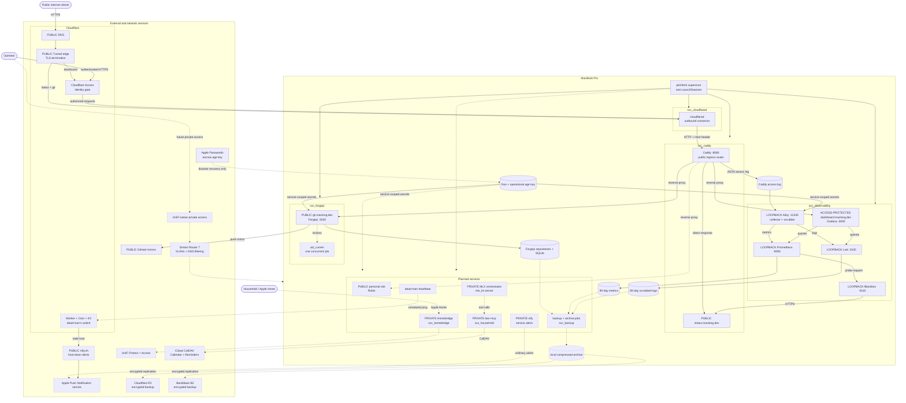

# Configuration

Personal macOS environment and hosted services, provisioned as one system.

## Architecture

Solid nodes are live; dashed nodes are planned. Exposure is stated on each
network-facing node.



## Install

```sh
/bin/sh -c "$(curl -fsSL https://raw.githubusercontent.com/mac95sb/configuration/main/setup.sh)"
```
