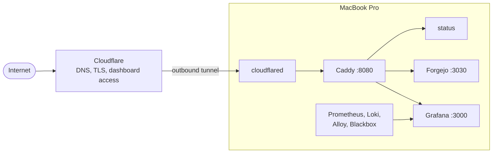

# Configuration

Personal macOS environment and hosted services, provisioned as one system.

## Install

```sh
/bin/sh -c "$(curl -fsSL https://raw.githubusercontent.com/mac95sb/configuration/main/setup.sh)"
```

## Architecture

One MacBook Pro hosts the public endpoints and observability stack. Cloudflare
terminates TLS and sends traffic through an outbound tunnel; Caddy routes each
hostname to a loopback-only backend or responds directly.



- `pitchfork` starts every daemon at boot.
- Daemons run under isolated service accounts; backends listen only on loopback.
- `fnox` decrypts service-scoped secrets at runtime.
- Forgejo repositories are mirrored to GitHub; observability data stays local.
