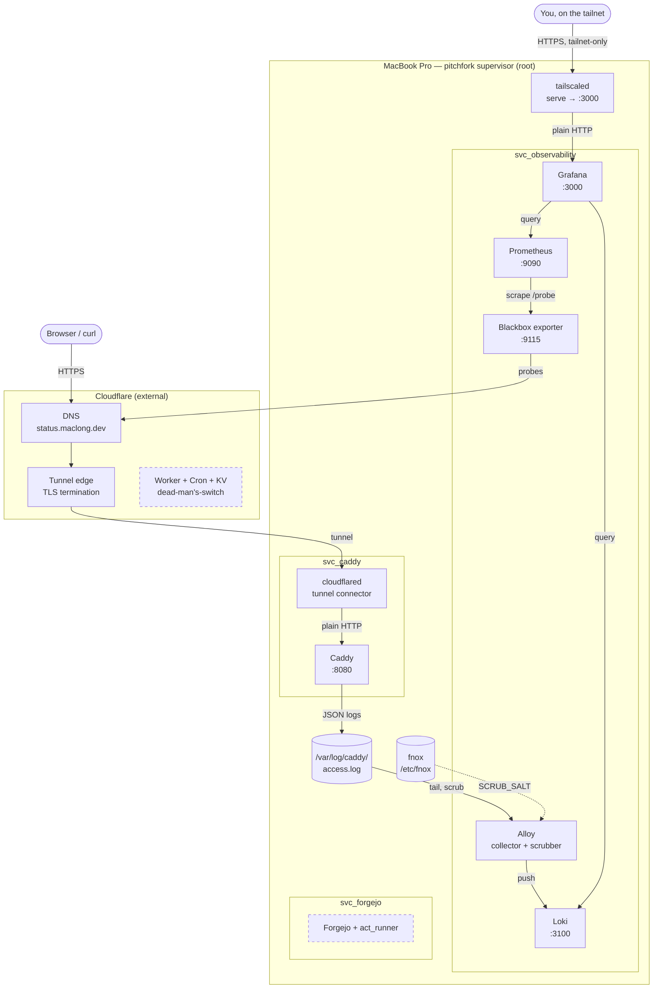

# Configuration

Personal macOS development environment configuration and home server
configuration.

## Architecture

Solid boxes are live today; dashed ones are planned but not built yet.
Not exhaustive — just what's in this repo or immediately next.



## Install

```sh
curl -fsSL https://raw.githubusercontent.com/mac95sb/configuration/main/setup.sh | sh
```

Answering "yes" to "Is this the home server?" also generates the
Cloudflare tunnel credentials. Everything else server-specific —
secrets, service accounts, the tunnel's DNS route, the supervisor —
stays as separate, independently re-runnable steps below rather than
folded into the script, since several of them are genuinely manual
(pasting a key into Apple Passwords, confirming a dashboard value).

## Layout

- `.config/` — dotfiles: shell, git, and the mise bootstrap config that
  provisions a new machine.
- `mise.toml` — one mise config for the whole system: dotfiles bootstrap
  and task entry points alike.
- `pitchfork.toml` — server daemons. Symlinked to `/etc/pitchfork/config.toml`
  by `mise run daemon:install`, so it's pitchfork's *global* config, not a
  project-local one — project configs only activate via `pitchfork project
  enter`/interactive sessions, they don't start at boot. Every service is a
  `[daemons.x]` entry with its own `user =` and `boot_start = true`, rather
  than a separate plist per service. `settings.supervisor.user` keeps the
  root-run supervisor's state/sockets under a real user's home instead of
  root's. Don't use pitchfork's `auto = ["start", "stop"]` on any daemon —
  that's a directory-triggered dev-workstation feature, not a fit for one
  that should just start once and stay running.
- `fnox.toml` — server secrets, encrypted. Safe to commit: every value is
  encrypted to two age recipients (operational key, root-readable on
  disk; escrow key, held only in Apple Passwords). One profile per
  service that actually needs a secret, resolved at exec time via
  `fnox exec --profile <name>` — a daemon with nothing to decrypt (Caddy,
  cloudflared) just runs directly, no fnox wrapper.
- `hk.pkl` — the quality gate for this repo (git hooks + `mise run
  check`/`fix`). Catches things like a malformed `pitchfork.toml` or an
  accidentally-unencrypted secret before they land in git, plus a
  `validate`/`check` step for each service config (`caddy`,
  `cloudflared`, `blackbox_exporter`, `promtool`, `loki`, `alloy`).
  `caddy validate` actually provisions the config (opens the log file,
  not just parses syntax), so it depends on `/var/log/caddy` existing —
  same class of dependency as the gate already having on `mise install`
  having pulled the validator binaries in the first place.
- `Caddyfile` — reverse proxy config. Public ingress is a Cloudflare
  Tunnel, which terminates TLS at Cloudflare's edge and forwards to
  Caddy over plain HTTP locally — Caddy doesn't do its own ACME for
  publicly-reachable sites here, since port 80 is never publicly
  reachable to begin with. Logs JSON access logs to `/var/log/caddy/`,
  owned by `svc_caddy` with group read for `svc_observability` — Alloy
  tails it from there.
- `cloudflared.yml` — the tunnel's ingress rules (hostname → local
  port), declarative and safe to commit — no secrets in it. The actual
  secret is the tunnel's credentials file, which `setup.sh` generates
  (see Tunnel below) and isn't tracked in git.
- `blackbox.yml` — uptime-probe modules for Blackbox exporter. First
  piece of the observability stack (Prometheus, Grafana Alloy, Loki,
  Blackbox, Grafana) — smallest and most independent, so it's first up.
  Runs under its own shared `svc_observability` account, same pattern
  as `svc_caddy`. Only declares probe modules, not targets — Blackbox
  itself just listens on `127.0.0.1:9115` for probe requests; the actual
  target comes from whatever scrapes it.
- `prometheus.yml` — scrape config. Scrapes itself and Blackbox's
  `http_2xx` probe against `status.maclong.dev` — this is what actually
  makes Blackbox probe anything. 90-day retention, `127.0.0.1`-only,
  data under `svc_observability`'s own home directory.
- `loki-config.yaml` — log storage. Single-binary mode, filesystem
  backend, 90-day retention, `127.0.0.1`-only.
- `config.alloy` — collection and scrubbing. Tails Caddy's access log
  and rewrites the client IP *in the stored log line itself* — a
  keyed/salted SHA3-256 hash (Alloy's `Hash` template function), not a
  plain hash or truncation, so the plaintext IP never reaches disk but
  the same IP always produces the same token (correlation intact). The
  salt comes from fnox as `SCRUB_SALT`, injected as an environment
  variable and referenced via River's `sys.env()` — never written to
  `config.alloy` itself.
- `grafana.ini` / `provisioning/datasources/` — visualization, the one
  deliberate exception to no-GUI. Prometheus and Loki provisioned as
  datasources automatically, no manual dashboard setup. `127.0.0.1`-only
  like everything else here — reached over Tailscale (see Grafana
  below), not exposed via the Cloudflare Tunnel. No mise-managed macOS
  build exists, so it's installed via `brew:grafana` in
  `[bootstrap.packages]` instead of `[tools]`.

## Secrets

Generate both age keypairs before `fnox.toml` does anything real.
`/etc/fnox` doesn't exist yet and isn't writable by a plain user anyway,
so the operational key is generated to a temporary file first and moved
into place with `sudo`:

```sh
age-keygen -o ~/operational.key   # temporary; moved into place below
age-keygen                        # escrow — never saved to disk, see below
```

`/etc/fnox/` keeps the operational key off any user's home directory and
out of anything else on the host that might get backed up or synced
unencrypted. `fnox.toml`'s `key_file` points straight at it, so nothing
needs `FNOX_AGE_KEY_FILE` set at runtime. Every `[daemons.x]` entry that
calls `fnox exec` runs as its own service account (not root), so the key
can't be root-only 400 — it's owned by a shared `fnox` group instead,
readable only by accounts actually in that group:

```sh
sudo dseditgroup -o create fnox
sudo install -d -m 750 -o root -g fnox /etc/fnox
sudo install -o root -g fnox -m 440 ~/operational.key /etc/fnox/operational.key
rm ~/operational.key
```

`mise run accounts:install` adds each service account to the `fnox`
group as it's created.

The escrow key's private half goes into Apple Passwords instead of a
file — not for day-to-day decryption (that's the operational key's job),
but so a from-scratch rebuild after losing the host entirely still has a
way in: `fnox.toml` encrypts to both public keys, so either private key
alone can decrypt it, and the escrow one is retrievable from Apple
Passwords on any device signed into the account, independent of the host
that died.

Put both printed public keys into `fnox.toml`'s `recipients` list.

A second group, `observability`, is separate on purpose — it's not
about secrets at all, it's cross-service *log* read access (Caddy's
access log is owned by `svc_caddy`; Alloy, running as
`svc_observability`, needs group-read on it). Reusing `fnox` for that
would be a semantic mismatch — group membership should say what it's
actually for.

## Service accounts

macOS has no declarative equivalent to `mise bootstrap accounts` (that
command is Linux-only). Each `[daemons.x]` entry's `user =` account is
created with a one-time `sudo sysadminctl -addUser ... -roleAccount` call
instead:

```sh
mise run accounts:install
```

`-roleAccount` gives each one a real home directory and UID but no
password and no login capability — they won't show up in the login
window. Whether they appear in System Settings → Users & Groups depends
on UID range and isn't worth relying on either way; list them directly
instead:

```sh
dscl . -list /Users | grep '^svc_'
```

## Tunnel

`setup.sh` prompts "Is this the home server?" and, if yes, runs
`cloudflared tunnel login` (browser OAuth, can't be scripted further)
and `cloudflared tunnel create home-caddy` — skipped if credentials
already exist locally. This writes a credentials JSON to `~/.cloudflared/`,
which needs moving into place for the `svc_caddy` daemon to use it:

```sh
sudo install -d -m 755 -o root -g wheel /etc/cloudflared
sudo install -o svc_caddy -g staff -m 400 ~/.cloudflared/<tunnel-id>.json /etc/cloudflared/<tunnel-id>.json
```

Only `svc_caddy` can read it (400, owned by that account directly — no
shared group needed since nothing else uses it). Update `cloudflared.yml`'s
`tunnel` and `credentials-file` fields to match the ID, and add the DNS
route for any hostname in its `ingress` list:

```sh
cloudflared tunnel route dns home-caddy <hostname>
```

On a rebuild, the tunnel ID changes (a fresh `tunnel create`, since
locally-managed tunnel credentials can't be regenerated for an existing
tunnel) — repeat the steps above with the new ID.

## Grafana

Reached over Tailscale instead of the Cloudflare Tunnel — it's for you,
not the public internet, and the real internal network doesn't exist
yet to do this properly. Install and log into Tailscale (GUI, `open -a
Tailscale` — the one deliberate GUI dependency in this whole setup,
since `tailscaled`'s open-source CLI build doesn't ship macOS binaries),
then, once, expose Grafana:

```sh
tailscale serve --bg --https=443 localhost:3000
```

Persists across reboots and `tailscaled` restarts on its own — not a
pitchfork daemon, just a one-time command. Check the resulting hostname
with `tailscale serve status`.

## Supervisor

```sh
mise run daemon:install   # registers pitchfork to start on boot
mise run daemon:reload    # after editing pitchfork.toml
```

`daemon:install` also does three things service accounts need but mise
has no declarative way to express: symlinks each daemon's binary into
`/usr/local/bin` (mise-managed ones via `mise which`; Grafana explicitly,
since it's a Homebrew formula, not a mise tool), since service accounts
have no mise shims in `PATH` and can't traverse into `/Users/mac` to
reach mise's own install paths anyway; grants bare traverse-only access
(`o+x`, no read) to `/Users/mac` itself, so service accounts can reach
the repo below it without exposing anything else in the home directory;
and creates `/var/log/caddy` (owned `svc_caddy:observability`, 750) for
Caddy's access log.
